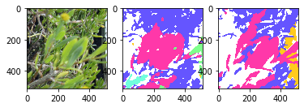
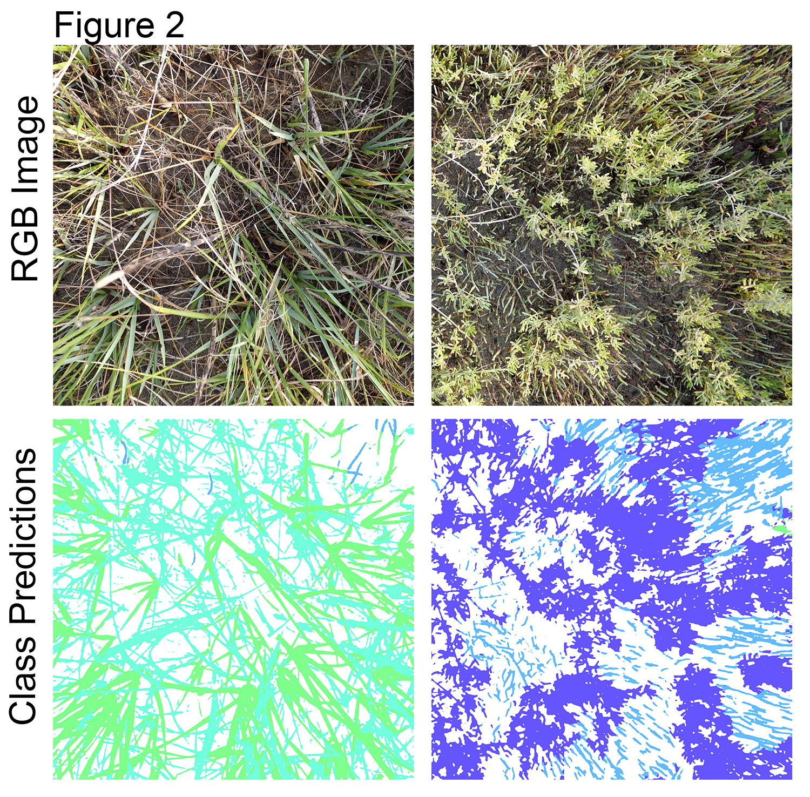

# Semantic Segmentation of Ecosystem Images using DeepLabV3+
augmentation of [DeepLab-V3+](https://arxiv.org/pdf/1802.02611) implementation (jfzhang95/pytorch-deeplab-xception) for use with large (e.g. 4k) images such as those obtained from ecosystems.


### Introduction
Our current use case is semantic segmentation of plant species in salt marsh ecosystem images. The model is trained on small image patches as shown in Figure 1.



The trained model can then be used to infer plant species in new larger images in a tiled fashion (Figure 2, not at full resolution). Using the maximum size tiles possible with available GPU memory (batch size = 1) produces better results. 


### Installation
0. Clone the repo.
1. Install dependencies:

    For PyTorch dependency, see [pytorch.org](https://pytorch.org/) for more details.

    For custom dependencies:
    ```Shell
    pip install matplotlib pillow tensorboardX tqdm
    ```
### Training of Deeplab with ResNet backbone
Follow steps below to train your model:

0. Configure your dataset path and download the salt marsh dataset in Data folder from google drive link in parent folder.

1. Input arguments: (see full input arguments via python train.py --help):
    ```Shell
    usage: train.py [-h] [--backbone {resnet,xception,drn,mobilenet}]
                [--out-stride OUT_STRIDE] [--dataset {marsh}]
                [--use-sbd] [--workers N] [--base-size BASE_SIZE]
                [--crop-size CROP_SIZE] [--sync-bn SYNC_BN]
                [--freeze-bn FREEZE_BN] [--loss-type {ce,focal}] [--epochs N]
                [--start_epoch N] [--batch-size N] [--test-batch-size N]
                [--use-balanced-weights] [--lr LR]
                [--lr-scheduler {poly,step,cos}] [--momentum M]
                [--weight-decay M] [--nesterov] [--no-cuda]
                [--gpu-ids GPU_IDS] [--seed S] [--resume RESUME]
                [--checkname CHECKNAME] [--ft] [--eval-interval EVAL_INTERVAL]
                [--no-val]

    ```
  ### Training of Deeplab with Compositional Sparse backbone
 0. Configure your dataset path and download the salt marsh dataset in Data folder from google drive link in parent folder.

 1. Install jupyter notebook and open by ```jupyter DeepLabV3 and CSN onSaltmarsh.ipynb```
 
 2. Run all columns of DeepLabV3 and CSN onSaltmarsh.ipynb
 
 3. Currently, to test out different hyperparameters of CSN, you will have make changes manually. We will update documentation to make this process better later. 


### Acknowledgement
This repository is a lightly modified version of JF Zhang's Deeplab v3+ repo(https://github.com/jfzhang95/pytorch-deeplab-xception).
[pytorch-deeplab-xception](https://github.com/jfzhang95/pytorch-deeplab-xception)

