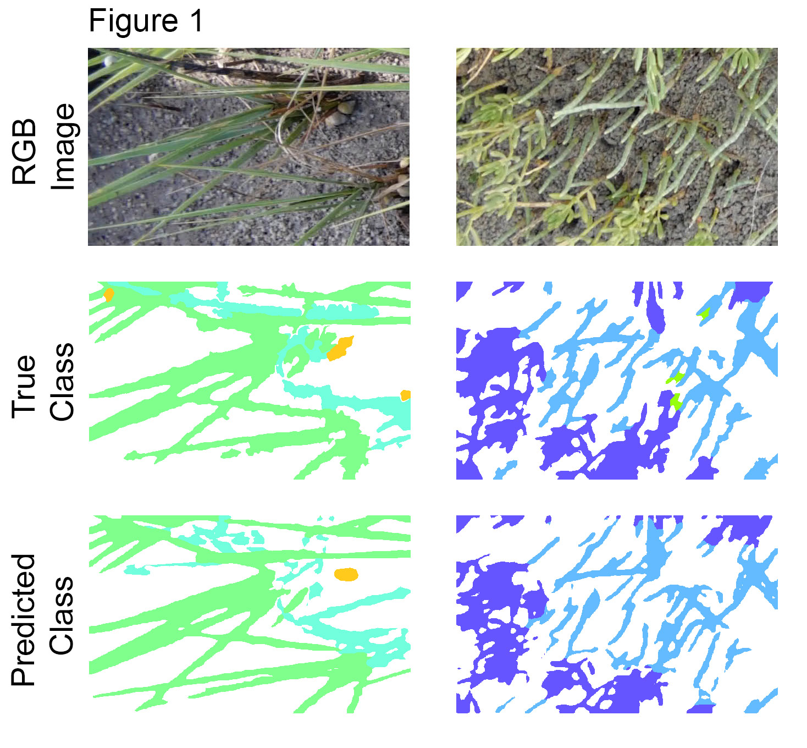

# Semantic Segmentation of Ecosystem Images using DeepLabV3+
augmentation of [DeepLab-V3+](https://arxiv.org/pdf/1802.02611) implementation (jfzhang95/pytorch-deeplab-xception) for use with large (e.g. 4k) images such as those obtained from ecosystems.


### Introduction
Our current use case is semantic segmentation of plant species in salt marsh ecosystem images. The model is trained on small image patches as shown in Figure 1.



The trained model can then be used to infer plant species in new larger images in a tiled fashion (Figure 2, not at full resolution). Using the maximum size tiles possible with available GPU memory (batch size = 1) produces better results. 


### Installation
0. Clone the repo.
1. Install dependencies:

    For PyTorch dependency, see [pytorch.org](https://pytorch.org/) for more details.

    For custom dependencies:
    ```Shell
    pip install matplotlib pillow tensorboardX tqdm
    ```
### Training of DeeplabV3+
Follow steps below to train your model:

1. Configure your dataset path and class labels in myinfo.py.

2. Initiate training by running one of the preconfigured scripts (train_marsh.sh, train_voc.sh, etc). parameter arguments (batch size, model backbone, initial learning rate, etc) can be configured by modifying the arguments in the shell script.

3. save the selected model for use in making predictions (e.g. in a "model_archive" folder). the prediction script expects a small yaml configuration file to accompany each pytorch model (see 'doc/model_data.yaml' for example)

# Predictions using DeeplabV3+
the predict_section.py script will section large images into tiles sufficiently small to fit in GPU memory  

1. place images to run predictions on into desired directory
2. adjust arguments in predict_sections_marsh.sh including image dimensions, image sections, etc
3. run predictions with predict_sections_marsh.sh. results will be placed in a "preds" subdirectory within the image source directory

### Acknowledgements
This repository is a lightly modified version of JF Zhang's Deeplab v3+ repo(https://github.com/jfzhang95/pytorch-deeplab-xception).
[pytorch-deeplab-xception](https://github.com/jfzhang95/pytorch-deeplab-xception)

